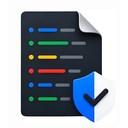

# LogShield Studio

**Gelişmiş Log Analiz ve Veri Gizleme Paketi**

&nbsp;

&nbsp;

  

---

Işık hızında log analizi ve kesintisiz veri gizleme deneyimini keşfedin. Güvenlik risklerini tespit edin ve hassas verileri yerel uygulama deneyimiyle anında maskeleyin.

[🇺🇸 Click here for English README](./README.md)

---

## 📋 İçindekiler

- [🎯 Proje Hakkında](#-proje-hakkında)
- [✨ Özellikler](#-özellikler)
- [🛠️ Teknolojiler](#️-teknolojiler)
- [🖥️ Ekran Görüntüleri](#️-ekran-görüntüleri)
- [🚀 Kurulum ve Kullanım](#-kurulum-ve-kullanım)
- [🛡️ Gizlilik ve Güvenlik](#️-gizlilik-ve-güvenlik)
- [👤 Geliştirici](#-geliştirici)

---

## 🎯 Proje Hakkında

**LogShield Studio**, hassas log verileriyle çalışan güvenlik mühendisleri ve yazılımcılar için tasarlanmış profesyonel bir araçtır. Log dosyalarındaki kişisel verileri (PII), kimlik bilgilerini ve güvenlik açıklarını tespit ederek kazara veri sızıntısı riskini ortadan kaldırır. "Önce Gizlilik" mimarisiyle inşa edilmiştir; tüm analizler yerel olarak cihazınızda gerçekleşir ve hiçbir veri buluta gönderilmez.

---

## ✨ Özellikler

| Özellik | Açıklama |
|---------|----------|
| ⚡ **Turbo Motor** | Özel Rust backend tarafından desteklenen yüksek hızlı log tarama. |
| 🛡️ **Akıllı Gizleme** | IP'leri, e-postaları, şifreleri ve hassas anahtarları otomatik tespit eder ve maskeler. |
| 🖱️ **Native Sürükle-Bırak** | Analize başlamak için logları arayüzün herhangi bir yerine bırakmanız yeterli. |
| 📊 **Risk Puanlama** | Log içeriğinin anlık risk değerlendirmesini görsel bir puanlama sistemiyle sunar. |

---

## 🛠️ Teknolojiler

| Kategori | Teknoloji |
|:--------:|:---------:|
| **Backend** |   |
| **Frontend** |    |
| **Analiz** |   |
| **Platform** |    |

---

## 🖥️ Ekran Görüntüleri

#### 📊 Ana Arayüz

  

#### 🔍 Etkileşimli Gizleme

  

---

## 🚀 Kurulum ve Kullanım

### 1. İndirme ve Kurulum
En son sürümü [Releases](https://github.com/kayaberkkan/logshield-studio/releases) sayfasından indirin.

- **macOS:** `LogShield Studio.dmg` dosyasını açın, uygulamayı Uygulamalar (Applications) klasörüne sürükleyin ve başlatın.
- **Windows:** `.exe` yükleyicisini çalıştırın.
- **Linux:** `.deb` paketini kurun.

### 2. Kullanım Adımları
1. LogShield Studio'yu başlatın.
2. Herhangi bir `.log` veya `.txt` dosyasını ana pencereye sürükleyip bırakın.
3. Tespit edilen riskleri ve maskelenmiş bilgileri etkileşimli bölmeli görünümde inceleyin.
4. Gizlenmiş logu paylaşmak veya daha fazla analiz yapmak için güvenli bir şekilde dışa aktarın.

---

## 🛡️ Gizlilik ve Güvenlik

LogShield Studio, **Zero-Cloud Trust** ilkesi üzerine kurulmuştur:
- **Yerel İşleme:** Tüm desen eşleştirme ve gizleme mantığı tamamen yerel makinenizde çalışır.
- **Telemetri Yok:** Kullanımınızı takip etmiyoruz veya analiz ettiğiniz loglardan veri toplamıyoruz.
- **Bellek İçi Analiz:** Veriler bellek içinde işlenir ve asla geçici veya bulut arabelleklerinde depolanmaz.

---

## 👤 Geliştirici

**Berkkan KAYA**

---
